# FlowCLD Expert Outcome Review

This packet contains five blinded scenarios. Candidate identifiers are opaque.
Complete Task A using outcomes only, then Task B using intervention details.
Do not try to infer how a candidate was generated.

## Ranking instructions

- Rank 1 is best. Use dense ties (1, 1, 2) only when outcomes are genuinely tied.
- Mark unacceptable results even if they still receive a relative rank.
- Confidence is 1 (low) through 5 (high).

## SCN-54DBB25264A0: Stabilizer: preserve useful behavior

**Team role:** A cooperative team responsible for stable, sustained activity at node b.

**Requested behavior:** Optimal behavior at b without collapse or runaway growth.

**A desirable result means:** Prefer bounded dynamics that preserve meaningful target activity.

**Protected constraints:** Keep all original nodes.; Do not fragment the graph.; No new self-loops.; Use finite bounded parameters.

All plots use time 0-40 and value axis -110 to 110. The shared symmetric-log scale keeps gradual near-zero changes visible while still showing large positive or negative values.

### Task A: outcome desirability

Judge the resulting dynamics and graph without considering intervention effort.

#### OUT-96B50862564E

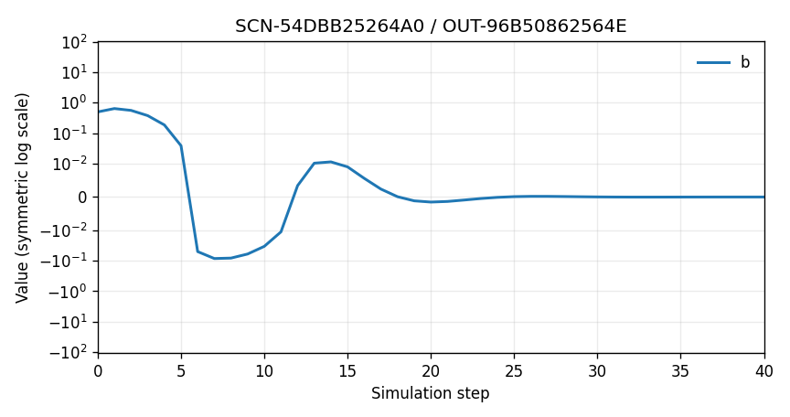

Final graph: 3 nodes ['a', 'b', 'c']; 3 directed edges [['a', 'b'], ['b', 'a'], ['b', 'c']]

Diagnostics: spectral radius 0.7273; target fit 0.000; binary activity 1.000; tail preservation 0.013; integrated preservation 0.650; transmission 0.945.

Constraint violations: none

#### OUT-A64728D66F4E

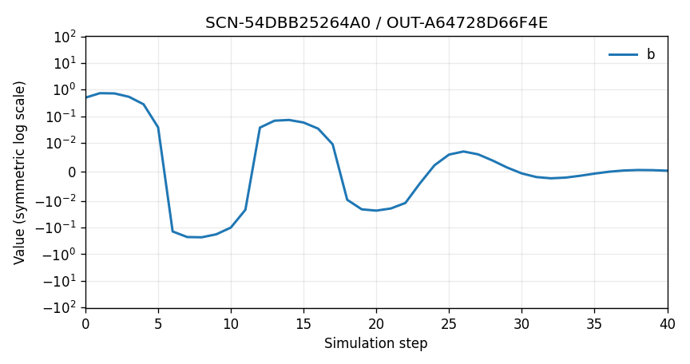

Final graph: 3 nodes ['a', 'b', 'c']; 3 directed edges [['a', 'b'], ['b', 'a'], ['b', 'c']]

Diagnostics: spectral radius 0.8260; target fit 0.000; binary activity 1.000; tail preservation 1.000; integrated preservation 1.000; transmission 1.107.

Constraint violations: none

#### OUT-B6B7EB542152

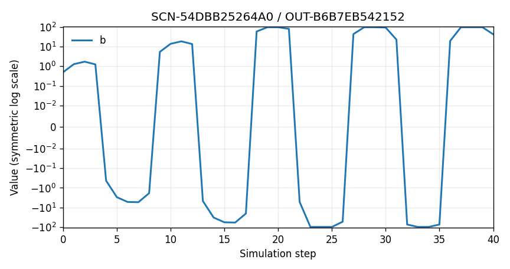

Final graph: 3 nodes ['a', 'b', 'c']; 3 directed edges [['a', 'b'], ['b', 'a'], ['b', 'c']]

Diagnostics: spectral radius 1.3054; target fit 1.000; binary activity 1.000; tail preservation 0.000; integrated preservation 0.000; transmission 2.295.

Constraint violations: none

#### OUT-C89F98BBA2E4

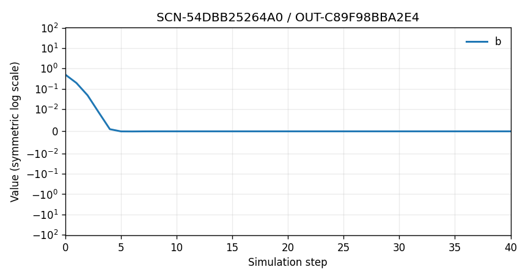

Final graph: 3 nodes ['a', 'b', 'c']; 3 directed edges [['a', 'b'], ['b', 'a'], ['b', 'c']]

Diagnostics: spectral radius 0.2102; target fit 0.000; binary activity 0.000; tail preservation 0.000; integrated preservation 0.182; transmission 0.297.

Constraint violations: none

#### OUT-CA14AE91EB78

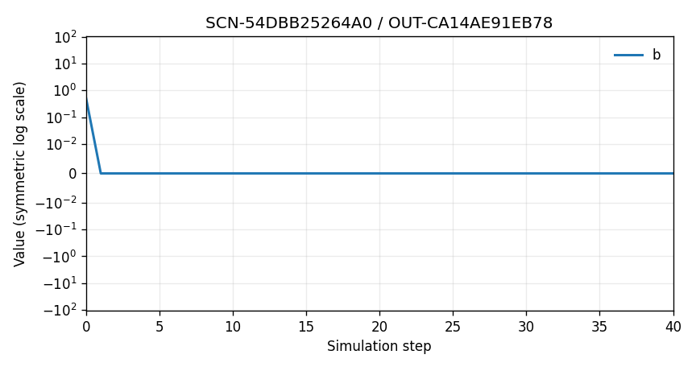

Final graph: 3 nodes ['a', 'b', 'c']; 3 directed edges [['a', 'b'], ['b', 'a'], ['b', 'c']]

Diagnostics: spectral radius 0.0000; target fit 0.000; binary activity 0.000; tail preservation 0.000; integrated preservation 0.122; transmission 0.000.

Constraint violations: none

#### OUT-ED75771E4311

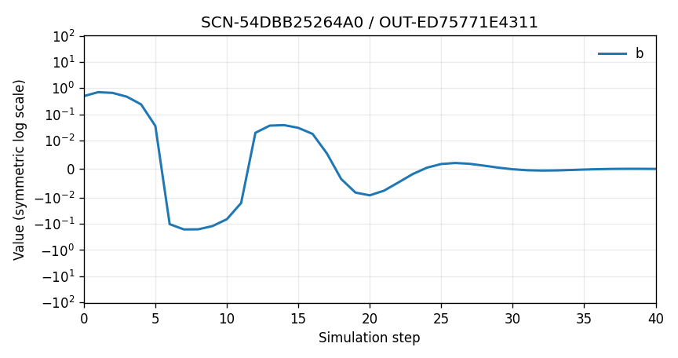

Final graph: 3 nodes ['a', 'b', 'c']; 3 directed edges [['a', 'b'], ['b', 'a'], ['b', 'c']]

Diagnostics: spectral radius 0.7901; target fit 0.000; binary activity 1.000; tail preservation 0.212; integrated preservation 0.836; transmission 1.053.

Constraint violations: none

#### Optional focused comparison

- OUT-96B50862564E versus OUT-C89F98BBA2E4: Which result better balances stability with meaningful target activity?

### Task B: transition desirability

Now judge whether each resulting change justified the intervention required.

| Candidate | Action count | Intervention magnitude | Plain-language intervention |
|---|---:|---|---|
| OUT-96B50862564E | 6 | 6 bounded parameter edits | Moderately lower retention and increase edge decay. |
| OUT-A64728D66F4E | 0 | none | No graph parameters or structure changed. |
| OUT-B6B7EB542152 | 9 | 9 bounded parameter edits | Raise retention and strengthen transmission toward its bounds. |
| OUT-C89F98BBA2E4 | 6 | 6 bounded parameter edits | Strongly damp all nodes and edges. |
| OUT-CA14AE91EB78 | 6 | 6 bounded parameter edits | Set retention to zero and fully decay all edge transmission. |
| OUT-ED75771E4311 | 6 | 6 bounded parameter edits | Apply small damping adjustments. |

## SCN-37DE2EC302E1: Disruptor: objective-relevant pressure

**Team role:** A bounded adversarial team seeking to degrade node b, not damage unrelated structure.

**Requested behavior:** Meaningful degradation of b while respecting protected graph constraints.

**A desirable result means:** Prefer objective-relevant disruption over arbitrary model destruction.

**Protected constraints:** Keep all original nodes.; Do not fragment the graph.; No new self-loops.; Use finite bounded parameters.

All plots use time 0-40 and value axis -110 to 110. The shared symmetric-log scale keeps gradual near-zero changes visible while still showing large positive or negative values.

### Task A: outcome desirability

Judge the resulting dynamics and graph without considering intervention effort.

#### OUT-6324DBD0C860

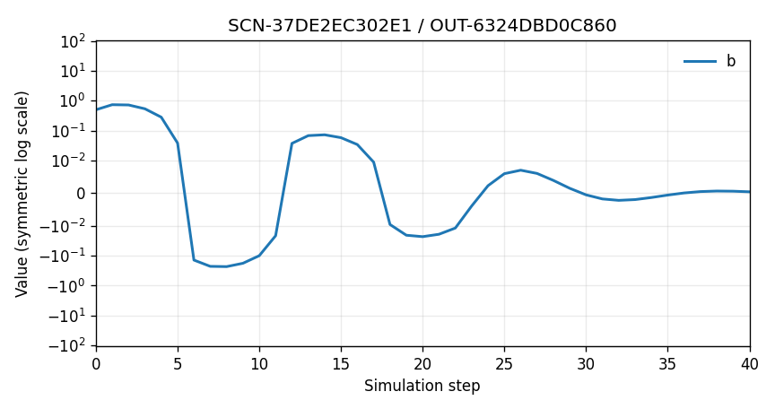

Final graph: 3 nodes ['a', 'b', 'c']; 3 directed edges [['a', 'b'], ['b', 'a'], ['b', 'c']]

Diagnostics: spectral radius 0.8260; target fit 0.000; binary activity 1.000; tail preservation 1.000; integrated preservation 1.000; transmission 1.107.

Constraint violations: none

#### OUT-708E769F2ABC

Final graph: 3 nodes ['a', 'b', 'c']; 3 directed edges [['a', 'b'], ['b', 'a'], ['b', 'c']]

Diagnostics: spectral radius 0.0000; target fit 0.000; binary activity 0.000; tail preservation 0.000; integrated preservation 0.122; transmission 0.000.

Constraint violations: none

#### OUT-735C7269C91D

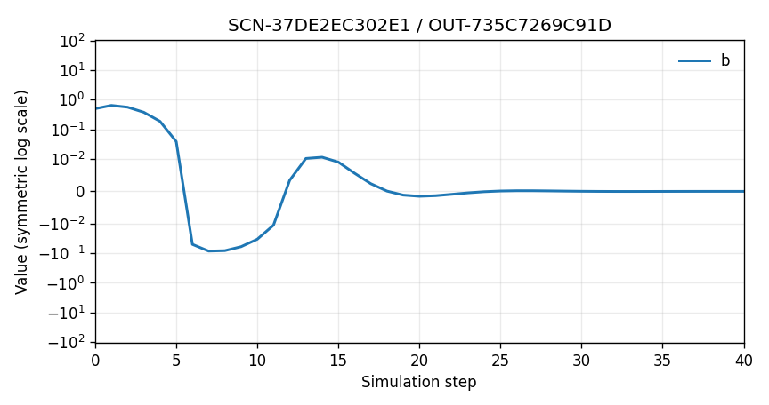

Final graph: 3 nodes ['a', 'b', 'c']; 3 directed edges [['a', 'b'], ['b', 'a'], ['b', 'c']]

Diagnostics: spectral radius 0.7273; target fit 0.000; binary activity 1.000; tail preservation 0.013; integrated preservation 0.650; transmission 0.945.

Constraint violations: none

#### OUT-A6201BEBD5FE

Final graph: 3 nodes ['a', 'b', 'c']; 3 directed edges [['a', 'b'], ['b', 'a'], ['b', 'c']]

Diagnostics: spectral radius 1.3054; target fit 1.000; binary activity 1.000; tail preservation 0.000; integrated preservation 0.000; transmission 2.295.

Constraint violations: none

#### OUT-B24B83AB031B

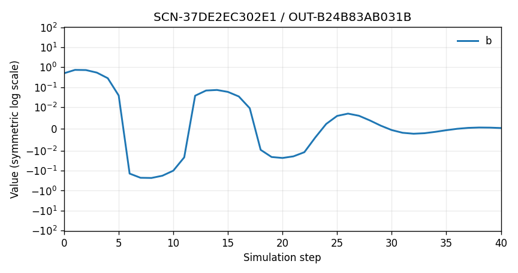

Final graph: 3 nodes ['a', 'b', 'c']; 3 directed edges [['a', 'b'], ['b', 'a'], ['b', 'c']]

Diagnostics: spectral radius 0.8260; target fit 0.000; binary activity 1.000; tail preservation 1.000; integrated preservation 1.000; transmission 1.107.

Constraint violations: none

#### OUT-CB9749D28DC6

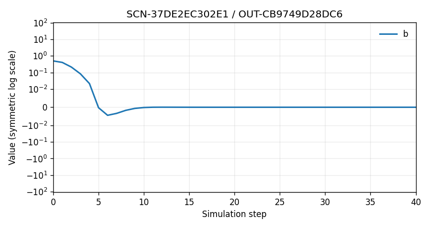

Final graph: 3 nodes ['a', 'b', 'c']; 3 directed edges [['a', 'b'], ['b', 'a'], ['b', 'c']]

Diagnostics: spectral radius 0.7200; target fit 0.000; binary activity 0.000; tail preservation 0.000; integrated preservation 0.300; transmission 1.107.

Constraint violations: none

#### OUT-CF00C5274C39

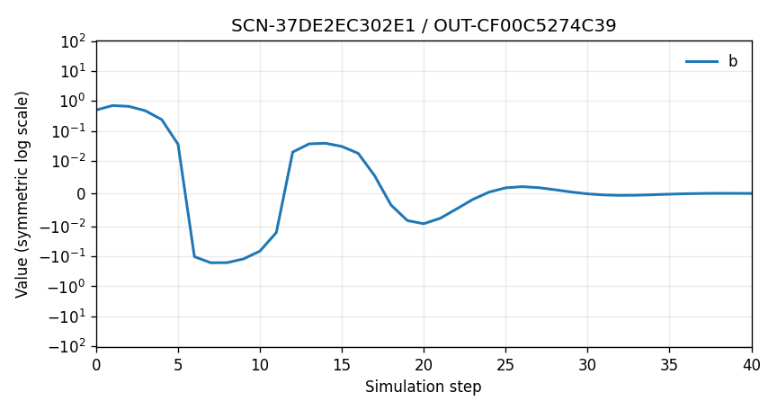

Final graph: 3 nodes ['a', 'b', 'c']; 3 directed edges [['a', 'b'], ['b', 'a'], ['b', 'c']]

Diagnostics: spectral radius 0.7901; target fit 0.000; binary activity 1.000; tail preservation 0.212; integrated preservation 0.836; transmission 1.053.

Constraint violations: none

#### OUT-E7D0596E5578

Final graph: 3 nodes ['a', 'b', 'c']; 3 directed edges [['a', 'b'], ['b', 'a'], ['b', 'c']]

Diagnostics: spectral radius 0.2102; target fit 0.000; binary activity 0.000; tail preservation 0.000; integrated preservation 0.182; transmission 0.297.

Constraint violations: none

#### Optional focused comparison

- OUT-CB9749D28DC6 versus OUT-6324DBD0C860: Which result better represents objective-relevant bounded disruption?

### Task B: transition desirability

Now judge whether each resulting change justified the intervention required.

| Candidate | Action count | Intervention magnitude | Plain-language intervention |
|---|---:|---|---|
| OUT-6324DBD0C860 | 1 | 1 bounded parameter edits | Strongly reduce an unrelated node's retention. |
| OUT-708E769F2ABC | 6 | 6 bounded parameter edits | Set retention to zero and fully decay all edge transmission. |
| OUT-735C7269C91D | 6 | 6 bounded parameter edits | Moderately lower retention and increase edge decay. |
| OUT-A6201BEBD5FE | 9 | 9 bounded parameter edits | Raise retention and strengthen transmission toward its bounds. |
| OUT-B24B83AB031B | 0 | none | No graph parameters or structure changed. |
| OUT-CB9749D28DC6 | 1 | 1 bounded parameter edits | Strongly reduce target-node retention. |
| OUT-CF00C5274C39 | 6 | 6 bounded parameter edits | Apply small damping adjustments. |
| OUT-E7D0596E5578 | 6 | 6 bounded parameter edits | Strongly damp all nodes and edges. |

## SCN-FA1BE0EC2084: Stability versus activity

**Team role:** A stabilizing team balancing a spectral limit against continued useful activity.

**Requested behavior:** Spectral radius at or below 0.82 while preserving a meaningful signal at b.

**A desirable result means:** Prefer true stabilization; do not treat numerical extinction as success.

**Protected constraints:** Keep all original nodes.; Do not fragment the graph.; No new self-loops.; Use finite bounded parameters.

All plots use time 0-40 and value axis -5 to 105. The shared symmetric-log scale keeps gradual near-zero changes visible while still showing large positive or negative values.

### Task A: outcome desirability

Judge the resulting dynamics and graph without considering intervention effort.

#### OUT-0B0B0DDEEA35

Final graph: 3 nodes ['a', 'b', 'c']; 3 directed edges [['a', 'b'], ['b', 'a'], ['b', 'c']]

Diagnostics: spectral radius 1.6075; target fit 1.000; binary activity 1.000; tail preservation 1.000; integrated preservation 0.954; transmission 1.741.

Constraint violations: none

#### OUT-0F340CBD4F8F

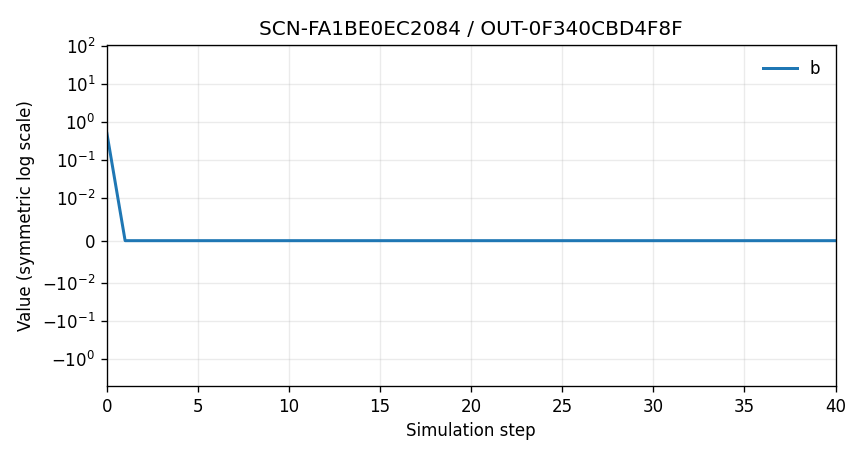

Final graph: 3 nodes ['a', 'b', 'c']; 3 directed edges [['a', 'b'], ['b', 'a'], ['b', 'c']]

Diagnostics: spectral radius 0.0000; target fit 0.000; binary activity 0.000; tail preservation 0.000; integrated preservation 0.000; transmission 0.000.

Constraint violations: none

#### OUT-251930B1D3F4

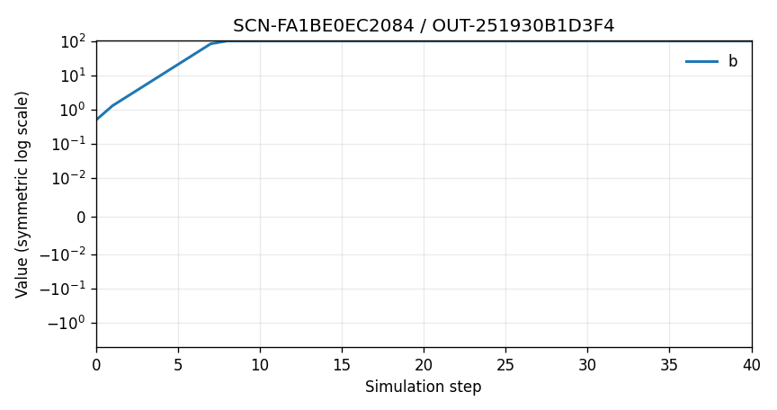

Final graph: 3 nodes ['a', 'b', 'c']; 3 directed edges [['a', 'b'], ['b', 'a'], ['b', 'c']]

Diagnostics: spectral radius 2.0000; target fit 1.000; binary activity 1.000; tail preservation 1.000; integrated preservation 0.969; transmission 2.595.

Constraint violations: none

#### OUT-49D7E984C0A7

Final graph: 3 nodes ['a', 'b', 'c']; 3 directed edges [['a', 'b'], ['b', 'a'], ['b', 'c']]

Diagnostics: spectral radius 1.7255; target fit 1.000; binary activity 1.000; tail preservation 1.000; integrated preservation 0.987; transmission 1.905.

Constraint violations: none

#### OUT-553BF07CCC46

Final graph: 3 nodes ['a', 'b', 'c']; 3 directed edges [['a', 'b'], ['b', 'a'], ['b', 'c']]

Diagnostics: spectral radius 1.7895; target fit 1.000; binary activity 1.000; tail preservation 1.000; integrated preservation 1.000; transmission 1.987.

Constraint violations: none

#### OUT-94DF4E253034

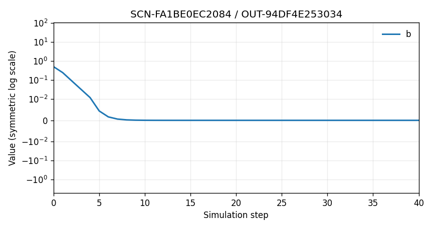

Final graph: 3 nodes ['a', 'b', 'c']; 3 directed edges [['a', 'b'], ['b', 'a'], ['b', 'c']]

Diagnostics: spectral radius 0.3669; target fit 0.000; binary activity 0.000; tail preservation 0.000; integrated preservation 0.000; transmission 0.451.

Constraint violations: none

#### Optional focused comparison

- OUT-0B0B0DDEEA35 versus OUT-0F340CBD4F8F: Does the stability improvement justify the difference in target activity?

### Task B: transition desirability

Now judge whether each resulting change justified the intervention required.

| Candidate | Action count | Intervention magnitude | Plain-language intervention |
|---|---:|---|---|
| OUT-0B0B0DDEEA35 | 6 | 6 bounded parameter edits | Moderately lower retention and increase edge decay. |
| OUT-0F340CBD4F8F | 6 | 6 bounded parameter edits | Set retention to zero and fully decay all edge transmission. |
| OUT-251930B1D3F4 | 7 | 7 bounded parameter edits | Raise retention and strengthen transmission toward its bounds. |
| OUT-49D7E984C0A7 | 6 | 6 bounded parameter edits | Apply small damping adjustments. |
| OUT-553BF07CCC46 | 0 | none | No graph parameters or structure changed. |
| OUT-94DF4E253034 | 6 | 6 bounded parameter edits | Strongly damp all nodes and edges. |

## SCN-F61FDF646970: Bounded structural intervention

**Team role:** A stabilizing team permitted to make small, reversible structural changes.

**Requested behavior:** Improve the target dynamics without fragmentation or node deletion.

**A desirable result means:** Prefer a causally useful bounded edit over complexity without benefit.

**Protected constraints:** Keep all original nodes.; Do not fragment the graph.; No new self-loops.; Use finite bounded parameters.

All plots use time 0-40 and value axis -5 to 105. The shared symmetric-log scale keeps gradual near-zero changes visible while still showing large positive or negative values.

### Task A: outcome desirability

Judge the resulting dynamics and graph without considering intervention effort.

#### OUT-617BF788035B

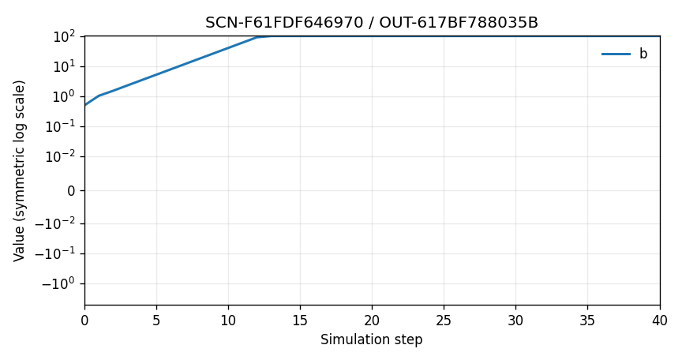

Final graph: 3 nodes ['a', 'b', 'c']; 3 directed edges [['a', 'b'], ['b', 'a'], ['b', 'c']]

Diagnostics: spectral radius 1.5046; target fit 1.000; binary activity 1.000; tail preservation 1.000; integrated preservation 0.971; transmission 1.905.

Constraint violations: none

#### OUT-733E2ACDFEA8

Final graph: 3 nodes ['a', 'b', 'c']; 3 directed edges [['a', 'b'], ['b', 'a'], ['b', 'c']]

Diagnostics: spectral radius 2.0000; target fit 1.000; binary activity 1.000; tail preservation 1.000; integrated preservation 0.912; transmission 2.595.

Constraint violations: none

#### OUT-8DE21847B291

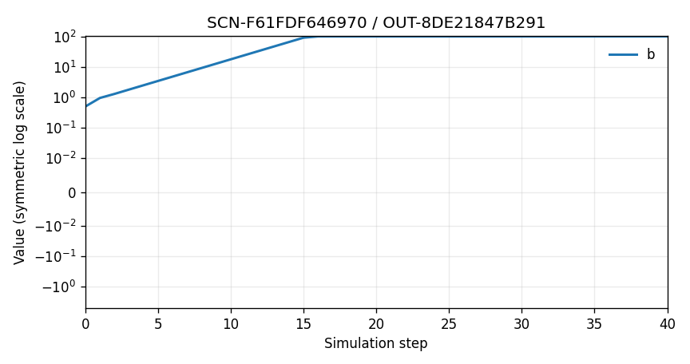

Final graph: 3 nodes ['a', 'b', 'c']; 3 directed edges [['a', 'b'], ['b', 'a'], ['b', 'c']]

Diagnostics: spectral radius 1.3867; target fit 1.000; binary activity 1.000; tail preservation 1.000; integrated preservation 0.893; transmission 1.741.

Constraint violations: none

#### OUT-B531F939F245

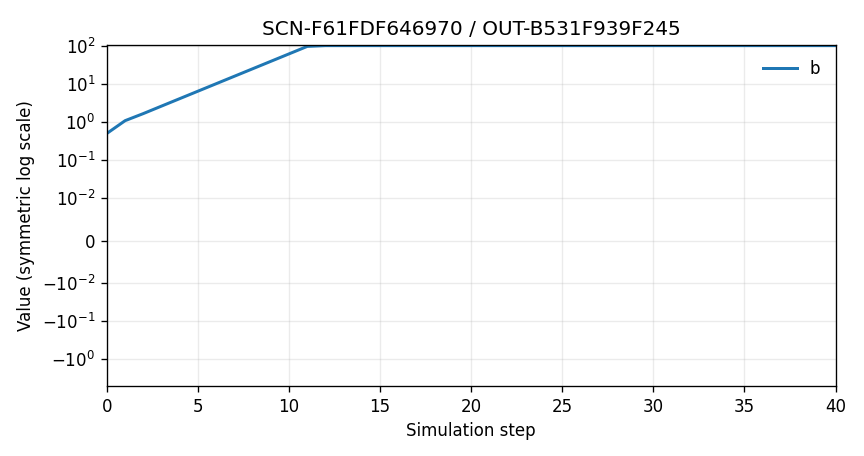

Final graph: 3 nodes ['a', 'b', 'c']; 3 directed edges [['a', 'b'], ['b', 'a'], ['b', 'c']]

Diagnostics: spectral radius 1.5685; target fit 1.000; binary activity 1.000; tail preservation 1.000; integrated preservation 1.000; transmission 1.987.

Constraint violations: none

#### OUT-BCBB584856F2

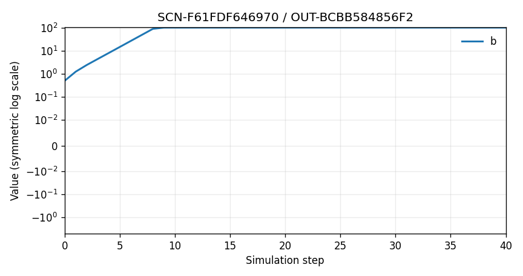

Final graph: 4 nodes ['a', 'b', 'c', 'd']; 5 directed edges [['a', 'b'], ['a', 'd'], ['b', 'a'], ['b', 'c'], ['d', 'b']]

Diagnostics: spectral radius 1.8244; target fit 1.000; binary activity 1.000; tail preservation 1.000; integrated preservation 0.931; transmission 3.587.

Constraint violations: none

#### OUT-C78017BEA783

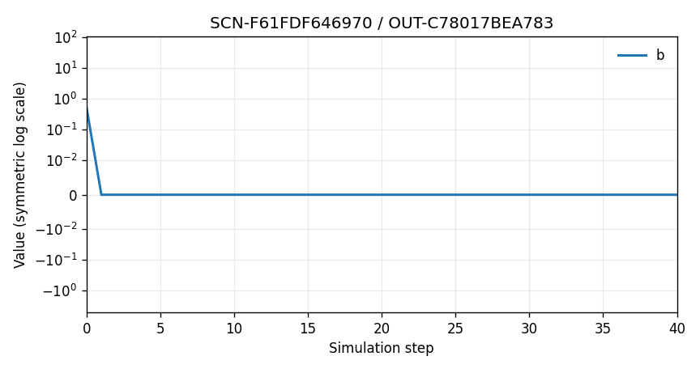

Final graph: 3 nodes ['a', 'b', 'c']; 3 directed edges [['a', 'b'], ['b', 'a'], ['b', 'c']]

Diagnostics: spectral radius 0.0000; target fit 0.000; binary activity 0.000; tail preservation 0.000; integrated preservation 0.000; transmission 0.000.

Constraint violations: none

#### OUT-E73D526ED443

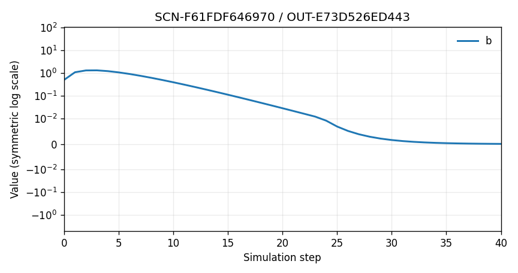

Final graph: 3 nodes ['a', 'b', 'c']; 2 directed edges [['a', 'b'], ['b', 'c']]

Diagnostics: spectral radius 0.7200; target fit 0.000; binary activity 1.000; tail preservation 0.000; integrated preservation 0.003; transmission 1.187.

Constraint violations: none

#### OUT-FD3EA3441A14

Final graph: 3 nodes ['a', 'b', 'c']; 3 directed edges [['a', 'b'], ['b', 'a'], ['b', 'c']]

Diagnostics: spectral radius 0.3667; target fit 0.000; binary activity 0.000; tail preservation 0.000; integrated preservation 0.000; transmission 0.451.

Constraint violations: none

#### Optional focused comparison

- OUT-E73D526ED443 versus OUT-BCBB584856F2: Which graph outcome is causally useful rather than merely more complex?

### Task B: transition desirability

Now judge whether each resulting change justified the intervention required.

| Candidate | Action count | Intervention magnitude | Plain-language intervention |
|---|---:|---|---|
| OUT-617BF788035B | 6 | 6 bounded parameter edits | Apply small damping adjustments. |
| OUT-733E2ACDFEA8 | 7 | 7 bounded parameter edits | Raise retention and strengthen transmission toward its bounds. |
| OUT-8DE21847B291 | 6 | 6 bounded parameter edits | Moderately lower retention and increase edge decay. |
| OUT-B531F939F245 | 0 | none | No graph parameters or structure changed. |
| OUT-BCBB584856F2 | 3 | three atomic structural edits | Add one connected mediator and two reinforcing edges. |
| OUT-C78017BEA783 | 6 | 6 bounded parameter edits | Set retention to zero and fully decay all edge transmission. |
| OUT-E73D526ED443 | 1 | one structural edit | Remove one reinforcing feedback edge. |
| OUT-FD3EA3441A14 | 6 | 6 bounded parameter edits | Strongly damp all nodes and edges. |

## SCN-FA9AB3A3E79A: Stable graph approaching zero

**Team role:** A stabilizing team reviewing a homogeneous graph whose signals gradually decay.

**Requested behavior:** Stable, bounded dynamics with enough persistent activity to remain meaningful.

**A desirable result means:** Distinguish desirable damping from a stable but functionally dead graph.

**Protected constraints:** Keep all original nodes.; Do not fragment the graph.; No new self-loops.; Use finite bounded parameters.

All plots use time 0-40 and value axis -5 to 105. The shared symmetric-log scale keeps gradual near-zero changes visible while still showing large positive or negative values.

### Task A: outcome desirability

Judge the resulting dynamics and graph without considering intervention effort.

#### OUT-0AC8C0FB68E9

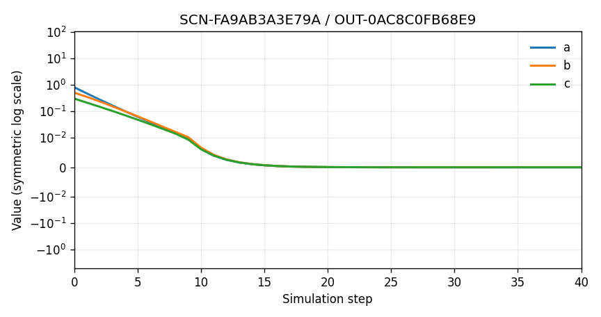

Final graph: 3 nodes ['a', 'b', 'c']; 3 directed edges [['a', 'b'], ['b', 'c'], ['c', 'a']]

Diagnostics: spectral radius 0.6418; target fit 0.000; binary activity 1.000; tail preservation 0.166; integrated preservation 0.892; transmission 0.275.

Constraint violations: none

#### OUT-550D17C95E0E

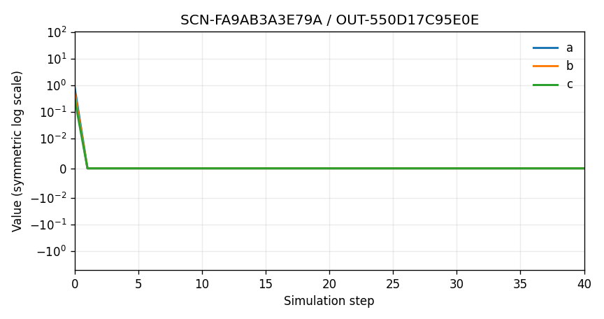

Final graph: 3 nodes ['a', 'b', 'c']; 3 directed edges [['a', 'b'], ['b', 'c'], ['c', 'a']]

Diagnostics: spectral radius 0.0000; target fit 0.000; binary activity 0.000; tail preservation 0.000; integrated preservation 0.311; transmission 0.000.

Constraint violations: none

#### OUT-55D98B0D7386

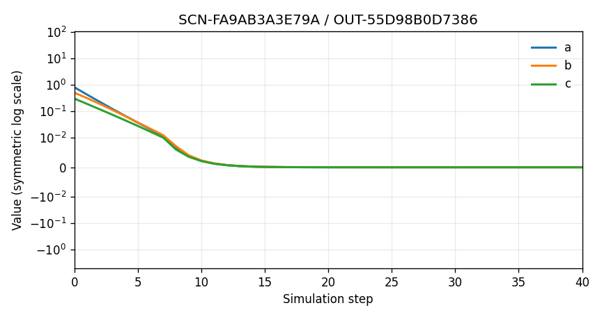

Final graph: 3 nodes ['a', 'b', 'c']; 3 directed edges [['a', 'b'], ['b', 'c'], ['c', 'a']]

Diagnostics: spectral radius 0.5774; target fit 0.000; binary activity 0.000; tail preservation 0.006; integrated preservation 0.751; transmission 0.232.

Constraint violations: none

#### OUT-7DFE348C7AD2

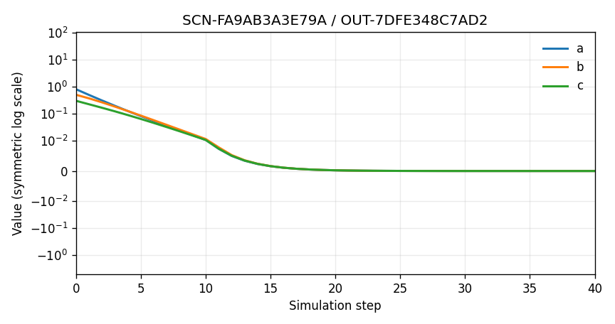

Final graph: 3 nodes ['a', 'b', 'c']; 3 directed edges [['a', 'b'], ['b', 'c'], ['c', 'a']]

Diagnostics: spectral radius 0.6790; target fit 0.000; binary activity 1.000; tail preservation 1.000; integrated preservation 1.000; transmission 0.297.

Constraint violations: none

#### OUT-7EE9D42DD762

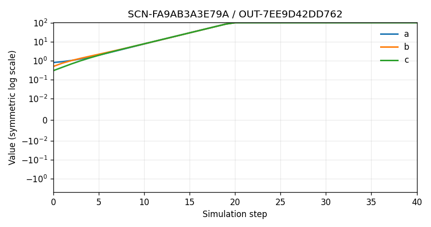

Final graph: 3 nodes ['a', 'b', 'c']; 3 directed edges [['a', 'b'], ['b', 'c'], ['c', 'a']]

Diagnostics: spectral radius 1.3060; target fit 1.000; binary activity 1.000; tail preservation 0.000; integrated preservation 0.000; transmission 0.918.

Constraint violations: none

#### OUT-BD974D164A43

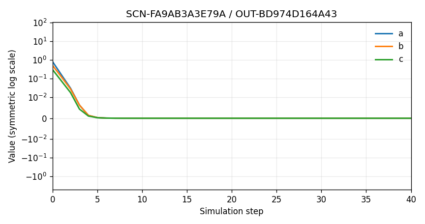

Final graph: 3 nodes ['a', 'b', 'c']; 3 directed edges [['a', 'b'], ['b', 'c'], ['c', 'a']]

Diagnostics: spectral radius 0.2196; target fit 0.000; binary activity 0.000; tail preservation 0.000; integrated preservation 0.401; transmission 0.119.

Constraint violations: none

#### Optional focused comparison

- OUT-55D98B0D7386 versus OUT-BD974D164A43: At what point does damping become functional extinction?

### Task B: transition desirability

Now judge whether each resulting change justified the intervention required.

| Candidate | Action count | Intervention magnitude | Plain-language intervention |
|---|---:|---|---|
| OUT-0AC8C0FB68E9 | 6 | 6 bounded parameter edits | Apply small damping adjustments. |
| OUT-550D17C95E0E | 6 | 6 bounded parameter edits | Set retention to zero and fully decay all edge transmission. |
| OUT-55D98B0D7386 | 6 | 6 bounded parameter edits | Moderately lower retention and increase edge decay. |
| OUT-7DFE348C7AD2 | 0 | none | No graph parameters or structure changed. |
| OUT-7EE9D42DD762 | 9 | 9 bounded parameter edits | Raise retention and strengthen transmission toward its bounds. |
| OUT-BD974D164A43 | 6 | 6 bounded parameter edits | Strongly damp all nodes and edges. |
